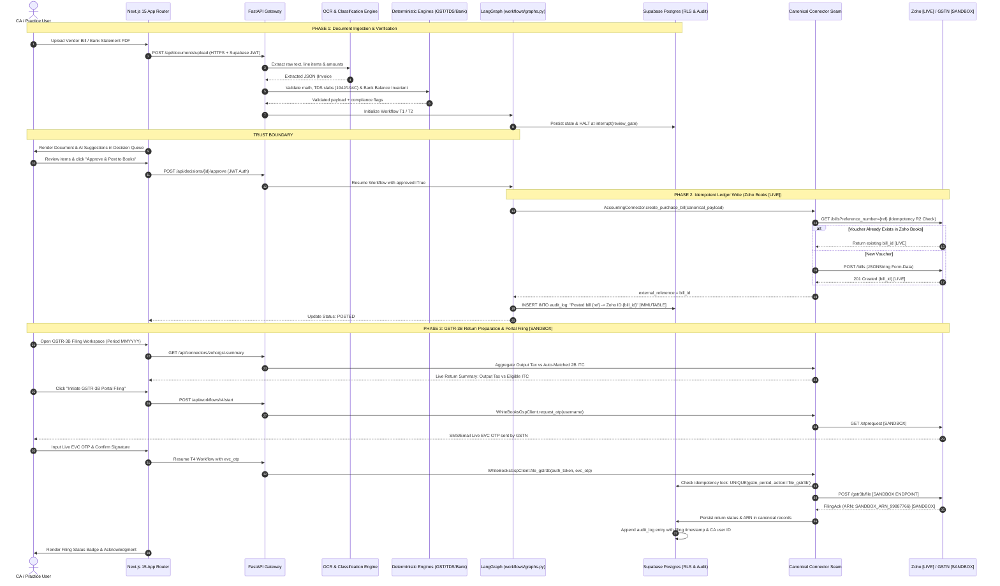

# firmOS — Reference Architecture v2: System & Security Spine
**Status:** Canonical Reference Specification  
**Version:** 2.0.0 (Hardened Production & Verification Architecture)  
**Governing Rule:** *Ponytail Mode — Simplest, most direct path that respects trust boundaries, liability gates, and empirical code evidence.*

---

## 1. Architectural Philosophy & The 7 Core Deltas

The first-generation diagrams mapped happy-path data flows between Next.js, FastAPI, LangGraph, and external connectors. **Reference Architecture v2** upgrades these flows into an enterprise-grade compliance command center by enforcing seven non-negotiable structural rules:

1. **Explicit Verification Status Overlays (`[LIVE]`, `[SANDBOX]`, `[MOCK]`):**
   Every external integration point, portal response, and acknowledgment number explicitly advertises its runtime maturity. The system never presents a sandbox or fallback mock as a live portal action.
2. **Three Hardened Trust Boundaries:**
   - **Trust Boundary #1 (User & Frontend Session):** Next.js 15 Client $\leftrightarrow$ FastAPI Cloud via HTTPS + Supabase JWT (`request.jwt.claim.firm_id`).
   - **Trust Boundary #2 (CA Human Liability Gate):** LangGraph Workflow $\leftrightarrow$ External Ledger/Portal execution via `interrupt(review_gate)` and CA explicit approval / live EVC OTP.
   - **Trust Boundary #3 (Bridge & Daemon Ingestion):** Office LAN Bridge / Webhooks $\leftrightarrow$ Cloud Ingestion via Bearer Auth + `X-Idempotency-Key` + RLS enforcement.
3. **Canonical Accounting Seam (`AccountingConnector` Protocol):**
   External providers (`Zoho Books`, `Tally Prime`) are isolated behind a canonical domain layer (`Contact`, `Bill`, `Invoice`, `Voucher`, `Ledger`, `TaxSummary`). Core engines and LangGraph workflows never touch vendor XML or JSON shapes.
4. **First-Class Bank Statement Ingestion Pillar:**
   Multimodal statement parser supporting digital PDFs (`pdfplumber` / `PyMuPDF`), structured spreadsheets (`pandas`), and scanned images (`Sarvam Vision`), protected by an invariant mathematical guard:
   $$\text{Opening Balance} + \sum \text{Credits} - \sum \text{Debits} \equiv \text{Closing Balance}$$
5. **Hardened Tally Prime Bridge with Staleness & Deletion Reconciliation:**
   Zero-dependency local desktop bridge pushing GUID-deduped ledgers and vouchers over HTTPS POST, backed by `tally_sync_logs` and tombstone/delete synchronization so removed desktop vouchers never leave ghost entries in cloud storage.
6. **Security & Audit Immutability Spine:**
   Supabase PostgreSQL Row-Level Security (`RLS`) strictly scoped by `firm_id`. Zero use of `service_role` bypasses in application code. All external access tokens encrypted at rest via AES-256-GCM (`TOKEN_ENC_KEY`). Audit trails (`audit_log`) enforced as database-level append-only tables (`REVOKE UPDATE, DELETE`).
7. **Complete Compliance & Communication Ecosystem:**
   Incorporates AI/RAG knowledge queries (`pgvector` + Sarvam embeddings) and client notifications (`WhatsApp Business API` templates) into the canonical architecture.

---

## 2. Diagram A: System-Wide Architecture, Trust Boundaries & Modular Seams

```mermaid
graph TB
    subgraph Frontend ["🖥️ Next.js 15 App Router (apps/web/src/features/*)"]
        UI_Docs["Documents Inbox<br/>(features/documents)"]
        UI_Decisions["CA Decision Queue<br/>(features/decisions)"]
        UI_Recon["Reconciliation Workspace<br/>(features/reconciliation)"]
        UI_Registers["Sales & Purchase Registers<br/>(features/registers) [LIVE/MOCK Fallback]"]
        UI_Connectors["Connector Dashboard<br/>(features/connectors)"]
    end

    %% TRUST BOUNDARY #1
    TB1{{"🔒 TRUST BOUNDARY #1<br/>HTTPS + Supabase JWT (firm_id claim)"}}
    Frontend ==> TB1

    subgraph Backend ["⚡ FastAPI Cloud Backend Python 3.12 (firmos-backend)"]
        subgraph APIRoutes ["API Route Layer (api/routes/*)"]
            API_Docs["/api/documents"]
            API_Decisions["/api/decisions"]
            API_Recon["/api/reconciliation"]
            API_Registers["/api/registers"]
            API_Bank["/api/bank-statements"]
            API_Conn["/api/connectors & /api/zoho"]
            API_Tally["/api/tally/push [Idempotent Receiver]"]
        end

        subgraph Workflows ["Stateful Workflows Layer (workflows/graphs.py)"]
            T1["T1: Vendor Bill Posting"]
            T2["T2: Bank Statement Recon"]
            T3["T3: GSTR-2B vs Purchase Register"]
            T4["T4: GSTR-3B Portal Filing"]
            T5["T5: ITR-4 Tax Return Preview"]
            Gate{{"🛑 TRUST BOUNDARY #2<br/>Human Liability Gate<br/>LangGraph interrupt(review_gate)"}}
        end

        subgraph Engines ["Deterministic Core Engines (engines/*) — Pure Math / Zero AI"]
            E_Tax["tax.py<br/>ITR Slabs, Rebate 87A, Surcharge"]
            E_GST["gst.py<br/>GST Slabs, ITC Eligibility, Net Payable"]
            E_TDS["tds.py<br/>TDS Sections (194J / 194C)"]
            E_Recon["reconcile.py<br/>RapidFuzz Fuzzy Match (±₹1 tolerance)"]
            E_Bank["bank_validator.py<br/>Opening + Credits - Debits == Closing"]
            E_OCR["sarvam.py / gemini<br/>Multi-Engine Document OCR"]
        end

        subgraph CanonicalSeam ["Canonical Connector Protocol (connectors/accounting.py)"]
            Proto["AccountingConnector Protocol<br/>Canonical Types: Contact | Bill | Invoice | Voucher | Ledger"]
            Adp_Zoho["ZohoBooksAdapter<br/>[LIVE CONFIGURED]"]
            Adp_Tally["TallyPrimeAdapter<br/>[READ-ONLY / LOCAL SYNC]"]
            Adp_GSP["WhiteBooksGspClient<br/>[SANDBOX CONFIGURED]"]
            Adp_WhatsApp["WhatsAppNotifyClient<br/>[CODE READY / NO CREDENTIALS]"]
        end
    end

    TB1 ==> APIRoutes

    %% Route to Workflow/Engine bindings
    API_Docs --> E_OCR
    API_Docs --> T1
    API_Decisions --> Workflows
    API_Recon --> T2
    API_Recon --> T3
    API_Recon --> E_Recon
    API_Bank --> E_Bank
    API_Registers --> Proto
    API_Conn --> Proto

    %% Workflow Gates
    T1 --- Gate
    T2 --- Gate
    T3 --- Gate
    T4 --- Gate
    T5 --- Gate

    Gate -->|CA Approved| Adp_Zoho
    Gate -->|CA Approved + EVC OTP| Adp_GSP

    subgraph Storage ["🛡️ Supabase PostgreSQL (RLS Enforced by firm_id)"]
        DB_Main[("Canonical Tables<br/>clients · connections · documents · sales_register")]
        DB_Tally[("Tally Tables<br/>tally_ledgers · tally_vouchers · tally_sync_logs")]
        DB_Audit[("Append-Only Audit Log<br/>audit_log (REVOKE UPDATE, DELETE)")]
        DB_Secrets["Encrypted Token Store<br/>AES-256-GCM (TOKEN_ENC_KEY)"]
    end

    APIRoutes --> Storage
    CanonicalSeam --> Storage

    subgraph External ["🌐 External Ecosystem & Portals"]
        Ext_Zoho[("Zoho Books Cloud API<br/>[LIVE CONFIGURED]")]
        Ext_GSTN[("GSTN / Income Tax Portals<br/>[SANDBOX VIA WHITEBOOKS]")]
        Ext_WA[("Meta WhatsApp Graph API<br/>[UNCONFIGURED]")]
    end

    Adp_Zoho <-->|OAuth2 / JSONString Form-Data| Ext_Zoho
    Adp_GSP <-->|2-Step Auth / JSON [SANDBOX]| Ext_GSTN
    Adp_WhatsApp -->|HTTPS POST| Ext_WA

    subgraph OfficeLAN ["🏢 CA Office Local Network (Private LAN)"]
        TB3{{"🔒 TRUST BOUNDARY #3<br/>HTTPS POST + Bearer Token + X-Idempotency-Key"}}
        Daemon["firmos-bridge daemon (bridge_daemon.py)<br/>Zero-Dependency Python Standard Library"]
        TallyApp["Tally Prime Desktop App<br/>http://localhost:9000 (TDL XML Engine)"]
    end

    TallyApp <-->|XML Queries / GUID Export| Daemon
    Daemon ==> TB3
    TB3 ==> API_Tally
```

---

## 3. Diagram B: End-to-End Document Ingestion, Verification, Posting & Filing Lifecycle



---

## 4. Subsystem Security & Verification Audit Table

| Subsystem | Primary Code Seam | Runtime Status Overlay | Security & Idempotency Invariant |
| :--- | :--- | :--- | :--- |
| **User Session & Authorization** | `apps/web/src/lib/auth.ts`<br/>`api/deps.py` | `[LIVE]` | Every API request requires a valid Supabase JWT bearer token containing the verified `firm_id` claim. |
| **Database Isolation (RLS)** | `supabase/migrations/*.sql` | `[LIVE]` | Row-Level Security (`RLS`) active on all tables. Queries filter exclusively by `firm_id`. Zero `service_role` query bypasses. |
| **Token Encryption at Rest** | `core/security.py`<br/>`connections` table | `[LIVE]` | OAuth refresh tokens and GSP secrets stored encrypted via AES-256-GCM (`TOKEN_ENC_KEY`). |
| **Audit Log Immutability** | `audit_log` table | `[LIVE]` | SQL privileges strictly enforce `REVOKE UPDATE, DELETE ON audit_log FROM PUBLIC, authenticated`. |
| **Zoho Books Connector** | `connectors/zoho_books/*` | `[LIVE CONFIGURED]` | Enforces R2 idempotency check (`GET /bills?reference_number`) before POSTing. Asserts $\sum Dr == \sum Cr$ on journals. |
| **Tally Prime Desktop Bridge** | `firmos-bridge/*`<br/>`api/routes/tally_routes.py` | `[LOCAL / READ-ONLY]` | Zero-dependency office daemon. Cloud pushes verified by Bearer token + `X-Idempotency-Key` UUID + GUID deduplication. |
| **GST GSP Integration** | `connectors/gst_filing/whitebooks/*` | `[SANDBOX CONFIGURED]` | WhiteBooks API client configured for sandbox. Filing requires live EVC OTP entry at runtime. |
| **Income Tax (ITR-4)** | `engines/tax.py`<br/>`workflows/graphs.py` | `[ENGINE LIVE / FILING DEFERRED]` | Tax slab & rebate calculation engine 100% live. Portal filing automation explicitly returns `NOT_IMPLEMENTED`. |
