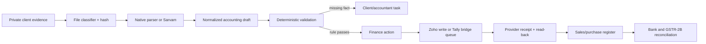

# firmOS production automation research and revised blueprint

## Product promise

**A CA uploads client evidence; firmOS turns it into a trustworthy, provider-confirmed accounting workstream.**

This does not mean “an AI posts every file”. It means firmOS receives, classifies, extracts, validates, de-duplicates, routes, proposes, writes under policy, reads the provider record back, updates registers, reconciles evidence, and asks a human only for an actual accounting judgement.

The CA should spend time on exceptions, not data entry.

## What “any client data” means

Accept these evidence classes in the first production release:

| Evidence | Supported input | First parser | Output |
| --- | --- | --- | --- |
| Vendor bill / sales invoice | PDF, JPG, PNG, HEIC | Native PDF text when available, then Sarvam Vision | Invoice/bill draft with fields and line items |
| Bank statement | CSV, XLS/XLSX, PDF | CSV/Excel parser, digital PDF parser, then Sarvam for scanned pages | Canonical bank lines and balance check |
| Register export | CSV, XLS/XLSX, Zoho/Tally export | Native tabular parser | Candidate register rows, never a direct ledger write |
| GSTR-2B evidence | Official downloaded JSON | JSON schema/parser | Period evidence and reconciliation targets |
| Zoho Books data | OAuth API + webhooks | Provider API | Provider-confirmed invoices, bills, contacts, accounts, bank candidates |
| Tally data | Local bridge export/read-back | Tally XML/JSON integration | Provider-confirmed ledgers and vouchers |

Do **not** accept executable files, password-protected archives, arbitrary ZIPs, or “any format” by promising a generic file reader. Reject unsupported data clearly and request the smallest useful alternative: PDF/image for a bill, CSV/XLSX for a statement/register, or official JSON for GSTR-2B.

Sarvam Vision is the right first-choice VLM for scanned Indian accounting evidence: it is purpose-built for document intelligence and supports text extraction from PDFs/scans across Indian languages. Native parsers stay ahead of it for structured files because they are cheaper and preserve typed columns. [Sarvam Vision](https://docs.sarvam.ai/api-reference-docs/getting-started/models/sarvam-vision), [Sarvam digitisation](https://www.sarvam.ai/apis/document-digitisation)

## Research conclusions applied to firmOS

### 1. One canonical evidence pipeline, not separate automation per page

The existing `documents`, `finance_actions`, `finance_runs`, `external_mappings`, register tables, and Tally bridge already form the spine. Extend that spine. Do not introduce n8n, Temporal, a second queue, or a generic agent framework.

### 2. Provider truth beats extracted text

Zoho has typed invoice/bill APIs, attachments, searchable references, and webhooks. A webhook only tells firmOS to fetch the record; the fetched provider record is the truth used to update a register. [Zoho invoices](https://www.zoho.com/books/api/v3/invoices/), [Zoho bills](https://www.zoho.com/books/api/v3/bills/), [Zoho webhooks](https://www.zoho.com/books/api/v3/webhooks/)

Tally import supports XML/JSON and explicitly expects operators to inspect exception reports after import. The bridge must therefore return the Tally receipt and read the voucher back before success. [Tally import guidance](https://help.tallysolutions.com/import-data-from-xml-or-json/)

### 3. Posted accounting history is immutable

ERPNext’s public accounting model is the correct precedent: posted ledger history is not silently rewritten; cancellation uses reverse entries. firmOS must follow that principle with provider-supported void/reversal/correction actions. [ERPNext immutable ledger](https://docs.frappe.io/erpnext/immutable-ledger-in-erpnext)

### 4. Heavy document conversion is a fallback, not a foundation

Docling is a good open-source contingency for broad document conversion and supports PDF, Office documents, HTML, images, email formats, and more. Do not add it now: Sarvam plus native `pandas`, PDF parsing, and JSON parsing covers the defined accounting intake. Add Docling only after a measured corpus shows a real unsupported-format gap. [Docling supported formats](https://docling-project.github.io/docling/usage/supported_formats/), [Docling source](https://github.com/docling-project/docling)

## The production data flow

Every arrow must carry a firm ID, client ID, source hash, correlation ID, actor/policy reason, and provider reference where one exists.

## The exact automation boundary

### Fully automatic, once configured

- Store and hash supported uploads privately.
- Extract text, tables, fields, and line items.
- Detect document direction/type.
- De-duplicate exact source files and exact provider records.
- Sync Zoho invoices/bills and Tally vouchers into registers.
- Refresh register rows after a confirmed provider write.
- Match exact GSTR-2B/purchase and bank/provider candidates.
- Create an assigned task/reminder when a deterministic requirement is missing.
- Reconcile totals and tax components; block invalid drafts.

### Policy-gated automatic posting

Only for a stable, explicit rule such as an approved supplier/customer, known item/account mapping, valid GST components, no duplicate, amount below cap, no RCM/asset/foreign-currency/credit-note exception, and a selected provider/company.

### Always requires a person

- New master/account/item/tax mapping.
- Material tax ambiguity, RCM, capitalization, unusual GST treatment, or backdated/closed-period entries.
- Duplicate or near-duplicate conflict.
- A client-uploaded sales invoice without an approved commercial source.
- Any action outside a firm’s written automation policy.
- GST portal filing.

## Revised build sequence

### A. Make writes safe before adding automation

**Where:** `firmos-backend/api/routes/documents.py`, `core/finance_actions`, `connectors/zoho_books`, `firmos-bridge`.

1. Remove the legacy direct `documents/{id}/post` provider write path.
2. Replace it with one `propose-post` route that creates a normalized draft and a hash-bound finance action.
3. Add typed Zoho invoice creation alongside the existing bill creation. No generic provider passthrough.
4. Keep Tally writes disabled until an approved document reaches the bridge and Tally read-back is confirmed.

**Definition of done:** there is no code path from file extraction to Zoho/Tally write that bypasses `FinanceActionEngine`.

### B. Build the minimal trusted draft model

**Where:** new Supabase migration, `api/routes/documents.py`, `engines/`.

Add only:

- `accounting_drafts` — one proposed posting per source document with normalized fields, line items, validation result, lifecycle, and source hash.
- `automation_rules` — firm-scoped, versioned allow-list mappings and amount limits.
- `provider_events` and `sync_cursors` — webhook de-duplication and safe recovery polling.

The draft validator is deterministic code, not an LLM prompt. Its checks are required values, duplicate keys, money/tax arithmetic, approved mapping, period state, and policy gates.

### C. Deliver one complete purchase slice

**Input:** client PDF/image → Sarvam → draft → approval/eligible auto-post → Zoho bill → attachment → provider read-back → purchase register → 2B reconciliation.

**Why first:** purchases provide the immediate CA value, match the existing typed Zoho bill and Tally purchase-voucher slices, and expose GST/ITC controls early.

Run it in shadow mode first: generate proposals and compare them with accountant decisions. Measure field accuracy, duplicate false positives, mapping coverage, and post corrections before allowing auto-post.

### D. Deliver one complete sales slice

**Input:** Zoho/Tally invoice sync first; client-uploaded sales invoice second.

Add typed Zoho invoice creation and Tally sales voucher creation. Require stronger controls than purchase: approved customer, invoice-number policy, item/service mapping, place of supply, and commercial-source evidence. A PDF alone does not auto-post sales.

### E. Make registers continuous

1. Register Zoho invoice/bill webhooks after the production callback is live.
2. Persist every event hash; fetch the record, then materialize the projection.
3. Run cursor-based catch-up polling for lost/replayed webhooks.
4. Let the user press **Sync now** as the recovery path.
5. Let the Tally bridge incrementally sync vouchers and use the same projection writer.

### F. Add the client collection loop last

Give the CA a secure client upload request that says exactly what is missing. Add WhatsApp/email only after consent, delivery, stop-reminder, and audit behavior exist. Do not make a generic chatbot the collection system.

## Accuracy, reliability, and cost controls

| Concern | Required control |
| --- | --- |
| Extraction cost | SHA-256 de-dup before OCR; parse CSV/XLSX/JSON locally; use Sarvam only for image/scanned/PDF document intelligence. |
| Incorrect fields | Preserve source page/region/text evidence; run arithmetic/GST checks; show only missing/different values to reviewer. |
| Duplicate posting | Source hash + provider reference + GSTIN/number/date/amount duplicate key + finance-action idempotency key. |
| Provider outage | Queue immutable action; retry with same key; read provider by reference before another create. |
| Webhook loss | Persist cursor and poll `last_modified_time`; never rely on a webhook alone. |
| Tally offline | Claim/lease queue; do not claim work twice; only mark success after response and read-back. |
| Model regression | Maintain a firm-approved, redacted golden corpus with expected fields and run it before changing prompts/models. |
| Compliance | Require CA policy approval for auto-post rules; never automate filing. |

## Product UI: the Cursor-for-finance experience

The primary screen is not a chat window. It is a four-state workbench:

1. **Inbox** — client evidence received and being processed.
2. **Ready** — verified drafts, showing the proposed accounting effect and whether policy can auto-post.
3. **Needs one answer** — only the missing fact, with a direct ask-to-client or assign-to-accountant action.
4. **Exceptions** — duplicate, tax mismatch, GSTR-2B/bank mismatch, provider rejection, or policy block.

Chat is the shortcut: “show me unposted purchase bills for June”, “why is this ITC blocked?”, “prepare sales register for Acme”. It must call the same read models and propose the same finance actions; it is never a separate write path.

## Production gates

1. GitHub repository, protected main branch, CI test/build, and secret scanning.
2. Backend deployed over HTTPS with JWT auth, strict-no-mock, private Supabase evidence storage, Sentry error tracing, and health checks.
3. Vercel frontend configured only with public browser values and backend origin; no provider/service secrets in `NEXT_PUBLIC_*` variables.
4. Real Zoho sandbox organization tests: create, duplicate retry, attachment, void/correction, webhook replay.
5. Licensed Tally test company tests: purchase and sales XML fixtures exported from that company, bridge restart, duplicate import, response/read-back.
6. CA sign-off using a golden corpus before enabling any rule-gated auto-post.

## What we deliberately will not build now

- A “universal file parser” or accepting unsafe arbitrary files.
- A new OCR vendor or Docling deployment before measured evidence justifies it.
- A generic accounting-agent write tool.
- Fully automatic master creation, ledger selection, or tax treatment.
- GST portal filing, OTP handling, or GSP automation.
- An auto-post switch that bypasses firm policy, audit, or provider read-back.

## Success metrics

Measure per firm and document type:

- supported-upload acceptance rate;
- extraction field accuracy and line-item accuracy on the golden corpus;
- percentage of drafts resolved without CA intervention;
- duplicate prevention rate and false-positive rate;
- time from upload to provider-confirmed posting;
- provider write/retry/read-back success rate;
- reconciliation exception aging;
- post-confirmation corrections/reversals (the key trust metric).
